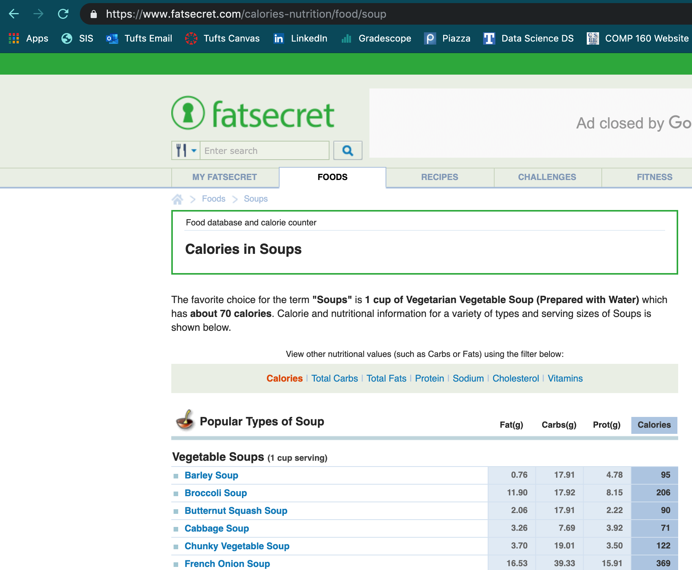

# beautiful-soups

Wassup wassup. So you've found my stupid soup project. Before you diss on my stupid soup project, let's give it the respect it deserves. Soup is great. In the \~midsommar\~ especially, soup absolutely schmacks sometimes. There's nothing I love more than coming back from my frisbee game and enjoying a nice warm bowl of Progresso's Chicken Noodle soup. I hope you love soup as much as I do!

No, but I wouldn't just do a personal coding project on soup for the heck of it... that would make me, like, weird. Really, I wanted to dabble into the world of web scraping. After doing a few quick Google searches, I learned that the few most popular Python web scraping libraries are called `Selenium`, `Requests`, `Scrapy`, `lxml`, and `Beautiful Soup 4`. As you can probably imagine, the name "Beautiful Soup 4" caught my attention, so I decided to explore its capabilities. I wanted to learn how web scraping even works. 

Once I read a few Medium articles and got the basic gist of it, I wanted to put my newly acquired knowledge to the test. I needed inspiration for a project that would let me apply the tools I had just read about. The first data vis project that I thought would be interesting was essentially a geography / population density project, but, c'mon... BORING! Instead, it occurred to me that my inspiration was sitting right in front of me. So, alas, I was set to embark on my one week project called `beautiful-soups` because soups are just that: beautiful. 

I quickly found a website that would be ideal for scraping purposes. It had the nutritional breakdown--fats, carbs, proteins, calories, and much more--of 67 soups. Yeah, you best believe I am not going to waste a single second manually entering all that data into a spreadsheet. 

Below is what the web table looks like. Feel free to visit the actual site https://www.fatsecret.com/calories-nutrition/food/soup



The 8 magical lines that let me obtain the soup and all things related to the soup:
```python
import requests
from bs4 import BeautifulSoup
r = requests.get('https://www.fatsecret.com/calories-nutrition/food/soup')
c = r.content
soup = BeautifulSoup(c, "lxml")
# print(soup)
main_content = soup.find('div', attrs = {'class': 'leftCellContent'})
# print(main_content)
content = main_content.find('tbody').text
# print(content)
linelist = content.splitlines()
# print(linelist)
```

In the jupyter notebook, you can uncomment the print statements to see what each line of code is accomplishing. 

From there, I made a pretty simple `pandas` dataframe, and I was off to the races. With the help of `matplotlib`, I could essentially plot any correlation I was interested in. Below are some of the visualizations that were interesting to me:

!(calories vs. soup in ascending order)[caloriegraph.png]
!(soup nutrition breakdown stacked bar graph)[beautifulsoups.png]
!(pie charts: average nutrition breakdown by soup type)[pie charts.png]
